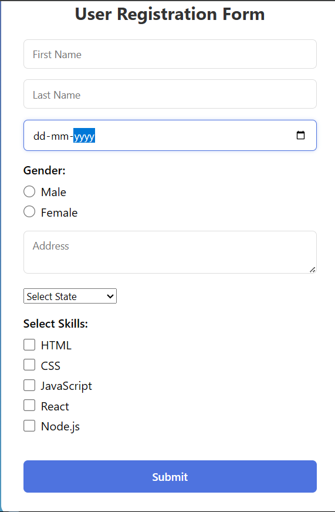
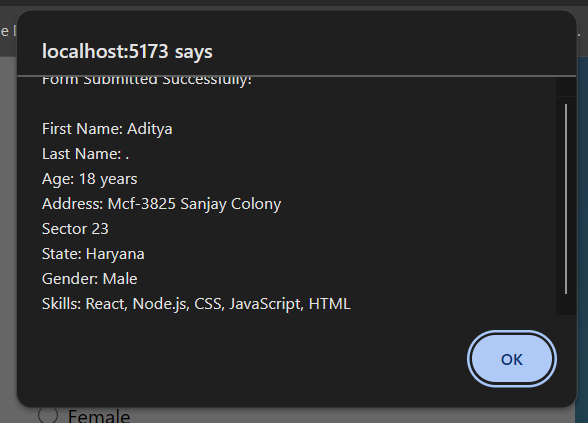

# User Registration Form
A simple, responsive User Registration Form built using React and Vite. This project demonstrates fundamental React concepts such as state management with useState, form handling, controlled components, and event handling.

