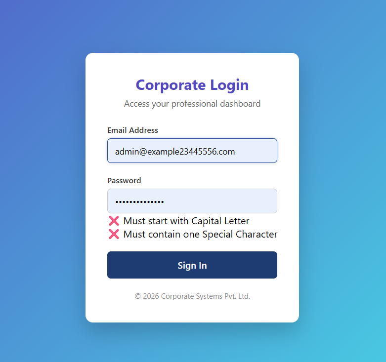
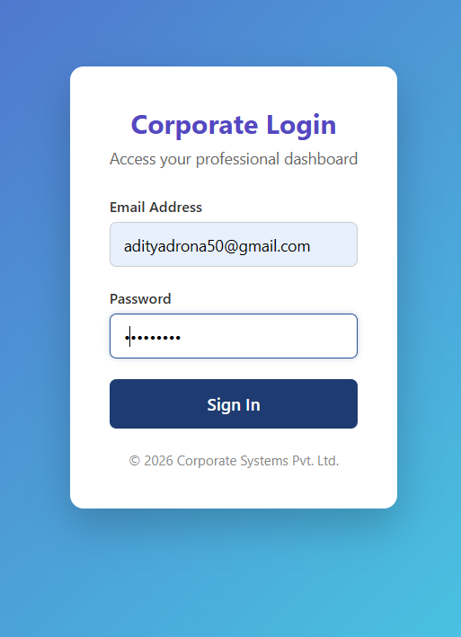

# Corporate Login Form
A dynamic and secure Corporate Login Form built using React and Vite. This project demonstrates essential front-end concepts such as controlled components, real-time input validation, regular expressions (Regex), and conditional rendering based on component state.

1) Should start with a capital Letter 
2) Should have atleast one number
3) Should have atleast one special charater
4) Should have atleast 5 Charaters

