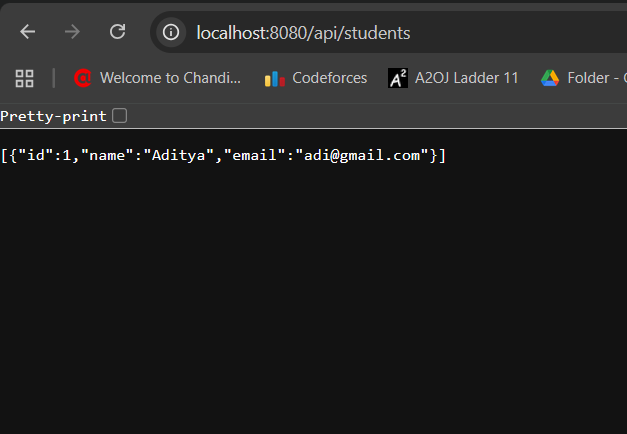
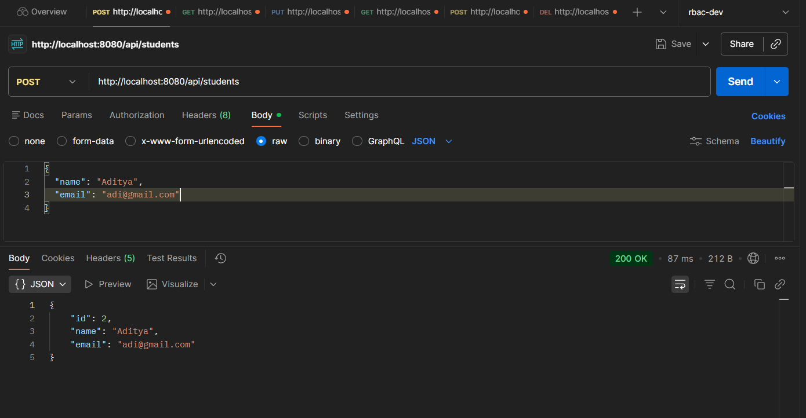
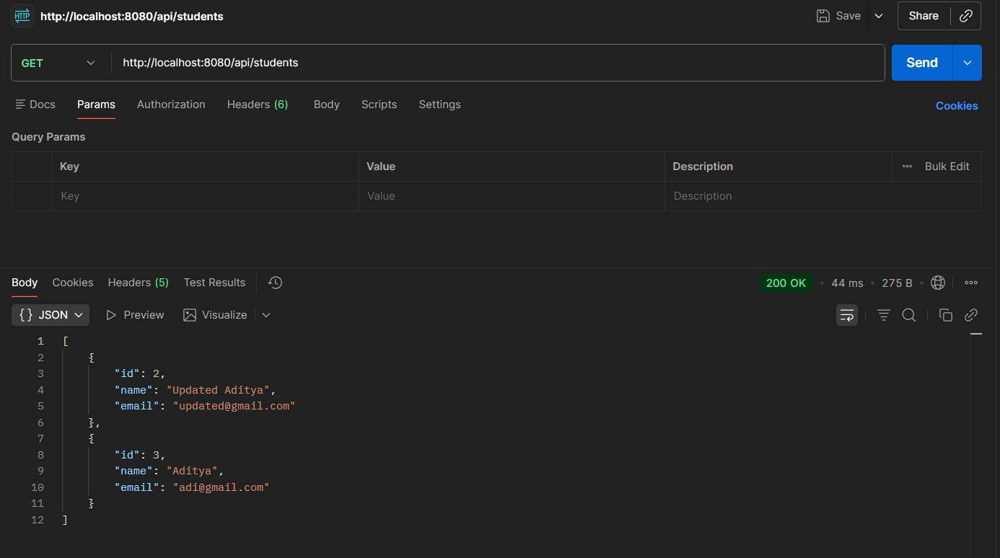
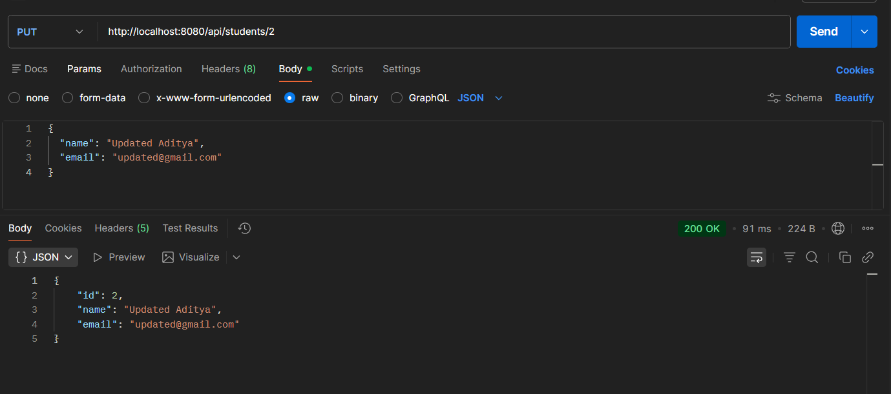
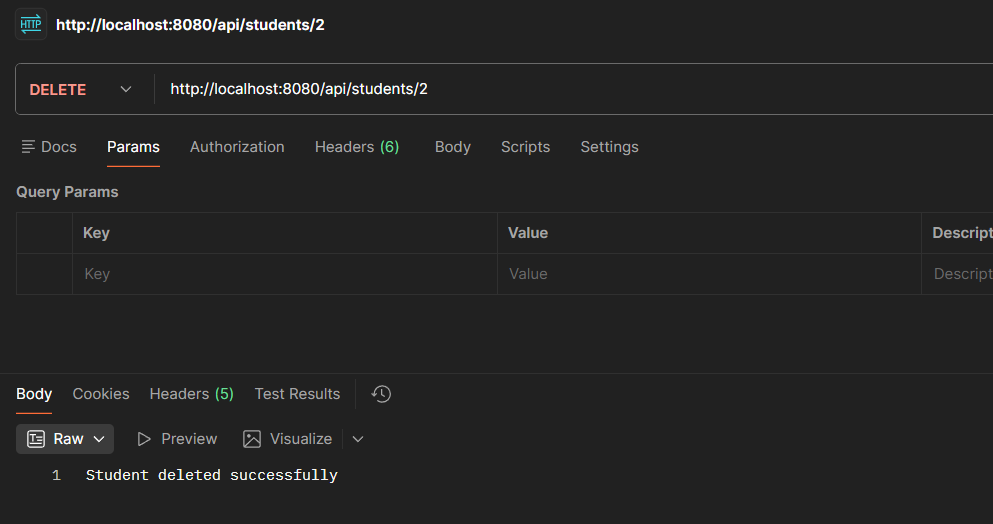
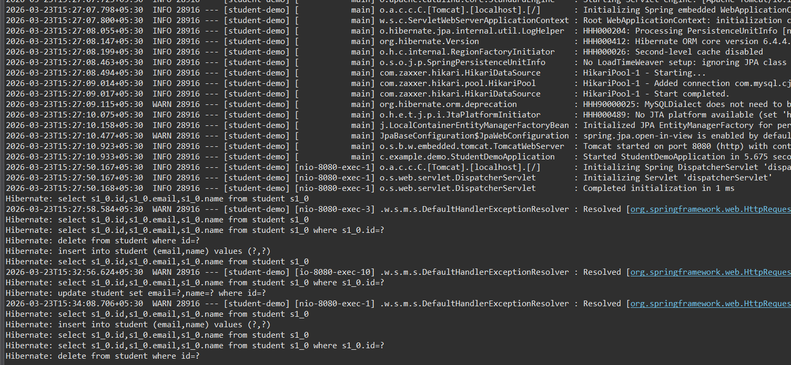

# EXP - 8 
Rest  Api using spring boot 
Overview

This project is a simple REST API built using Spring Boot, Spring Data JPA, and MySQL.
It performs basic CRUD operations for managing student data.

Tech Stack
Java 17
Spring Boot 3
Spring Data JPA
MySQL
Maven
Eclipse IDE

