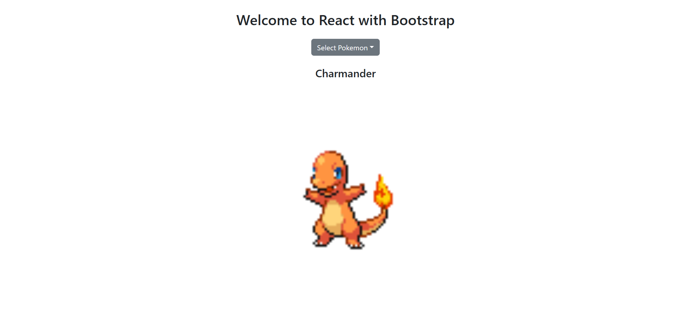
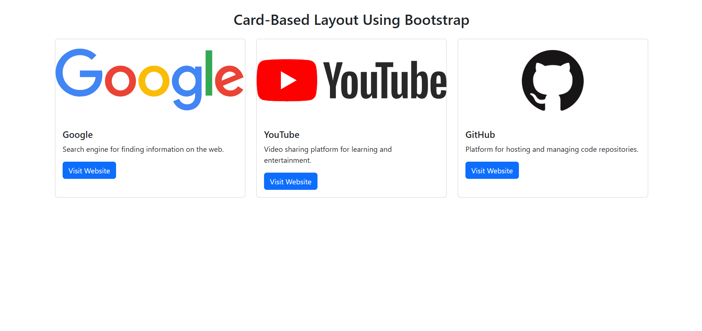
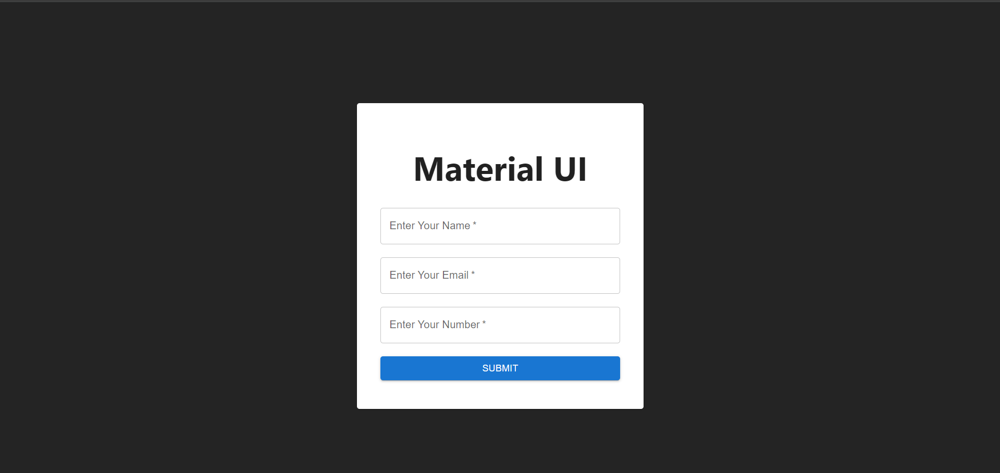
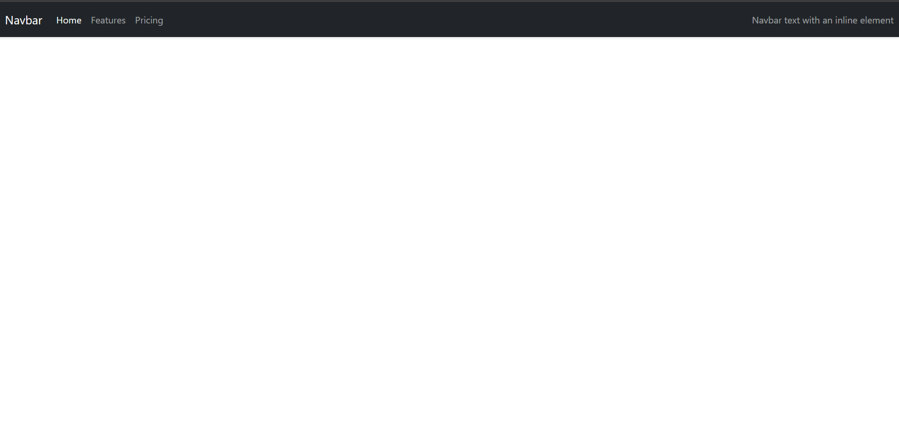
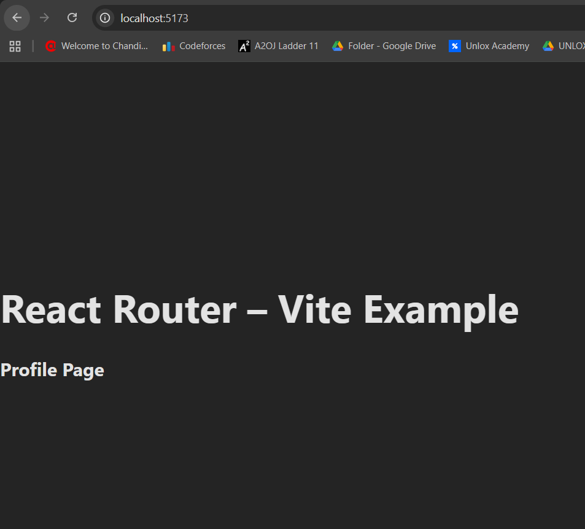
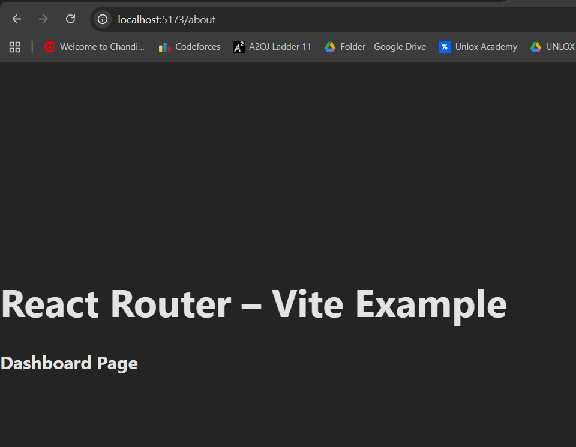
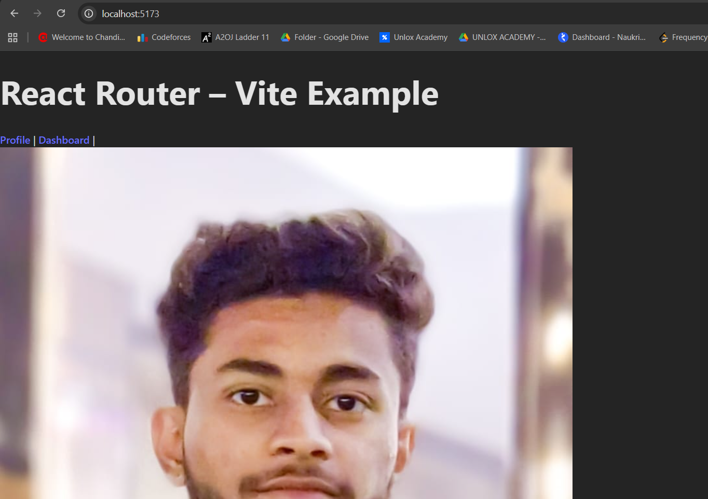
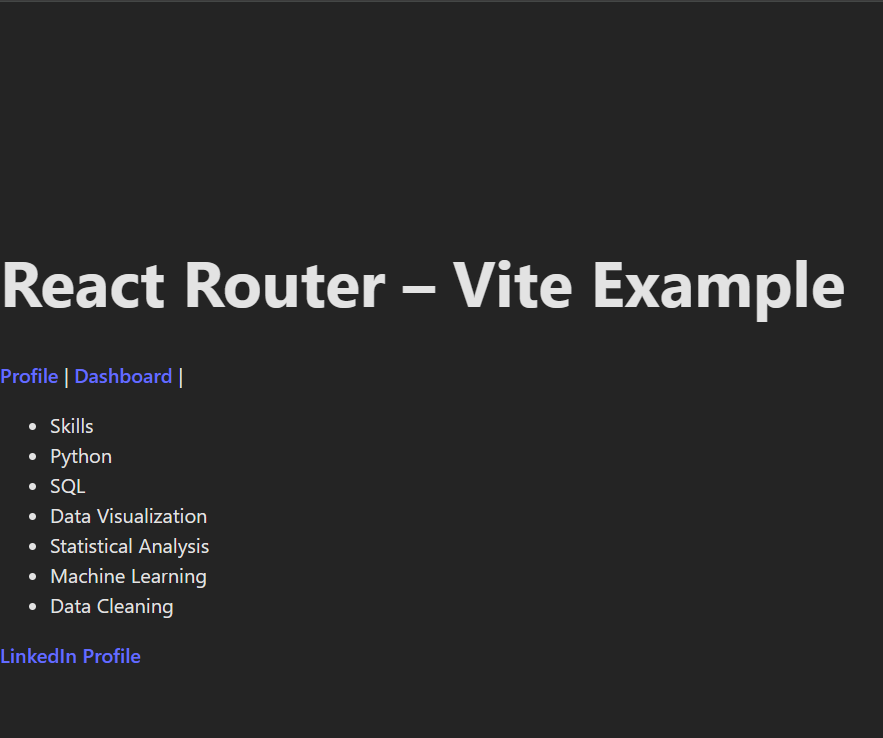
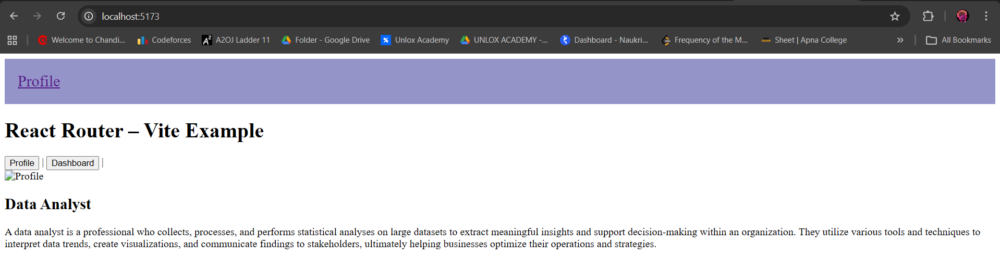
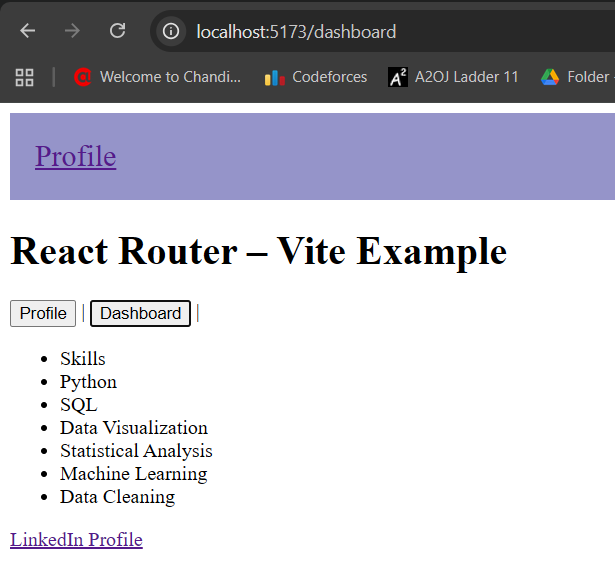

# EXP 2

Designing UI using bootstrap components
software use:-
React 
Bootstrap
Web Browser

Card Based layout using bootstrap used card componets from bootstrap framework
software use:-
React 
Bootstrap
Web Browser

Design a user interface using Material UI components in React
Software Used:-
React 
Bootstrap
Web Browser

Navigation Bar using components adding navlinks and navtags
Software used:-
React 
Bootstrap
Web Browser

# EXP 3
EXP - 3.1
Basic client side routing using react router
Software : node.js, react, reactor-route dom 

EXP - 3.2
Implement navigations link in spa using react router link
Software : node.js, react, reactor-route dom

EXP - 3.3
Create multipage SPA using client side routing
Software : node.js, react, reactor-route dom

